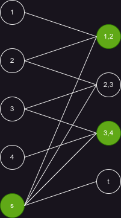

# Сложность вычислений 

## Поиск наименьшего связного доминирующего множества(CDS)

### Определения

Связное доминирующее множество графа *G* - это множество *D* вершин с двумя свойствами:

1. Любой узел в *D* может достичь любого другого узла в *D* по пути, который остается полностью внутри *D*. То есть *D* индуцирует связный подграф *G*.
2. Каждая вершина в *G* либо принадлежит *D*, либо смежна с вершиной в *D*. То есть *D* является доминирующее множество из *G*.

Минимальное связное доминирующее множество графа *G* - это связное доминирующее множество с наименьшей возможной мощностью среди всех связанных доминирующих множеств *G*. Число связного доминирования в *G* - это количество вершин в минимальной связной домине.

### Доказательство: CDS - NP-трудное

Сведем NP-полную [задачу о покрытии множества(SET-COVER)](https://optimization.cbe.cornell.edu/index.php?title=Set_covering_problem) к CDS.

SET-COVER: По данному семейству *C* подмножеств множества *X* и натуральному числу *k* <= |X| определить, содержит ли *C* покрытие мощностью не более *k*. Покрытие - подсемейство *A* в *C*, такое что каждый элемент *X* содержится хотя в одном подмножестве в *A*.

Для входного семейства *С* и исходного множества *X* построим двудольный граф *H* с вершинами: x1, x2 ... xn - для элементов *X* и  S1, S2 ... Sm - для подмножества семейства *C*(Всего n+m вершин). Добавим ребро между вершинами a и b, только если a принадлежит b. Далее, получим граф *G* из *H* путем добавления двух новых вершин s и t. Соединим s с t и с каждой Si для i от 1 до m. 

1) Допустим, *C* имеет покрытие *A* размером не более k. Тогда вершины из *A* и s образуют CDS размером не более k+1.

2) Предположим, что в *G* есть CDS *C* размера k' ≤k+1. Заметим, что *C* должна содержать вершину s, чтобы доминировать вершину t. Более того, если a принадлежит *C* для некоторого a в *X*, то *C*-{a} все еще является CDS. В самом деле, чтобы существовал путь, соединяющий a и s, должно существовать *A* из *C*, такое что a принадлежит *A*. Таким образом, a может доминировать над *A*. Более того, все вершины, над которыми доминирует a, также доминируют над s. Таким образом, *C*-{a} по-прежнему является CDS. Обозначим через *C'* CDS, полученную из *C* путем удаления t и всех элементов в *X*. Тогда *C'* содержит s и некоторые вершины, помеченные подмножествами A1, A2...Ah (h ≤ k' - 1) в *C*. Эти h подмножеств A1,A2...Ah должны покрывать все элементы в *X*. Поэтому *G* имеет CDS размера не более k + 1 тогда и только тогда, когда *C* имеет покрытие множества размера не более k.

Таким образом, CDS - NP-трудна.

### Пример

В терминах SET-COVER:

*X* = {1, 2, 3, 4}

*C* = {{1,2}, {2,3}, {3, 4}}

k = 2

*A* = {{1,2}, {3, 4}}

В терминах CDS:

CDS - вершины s, v_1_2, v_3_4
